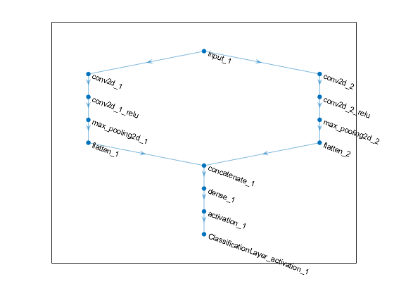
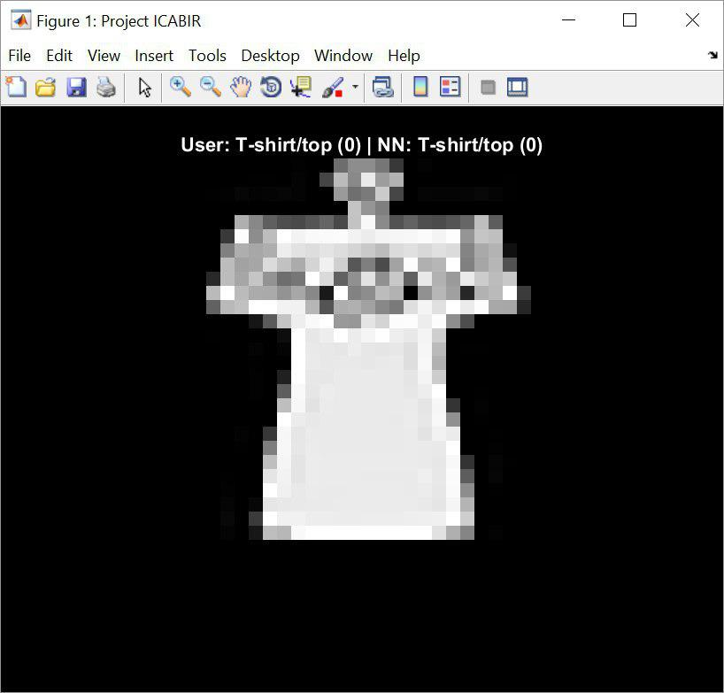
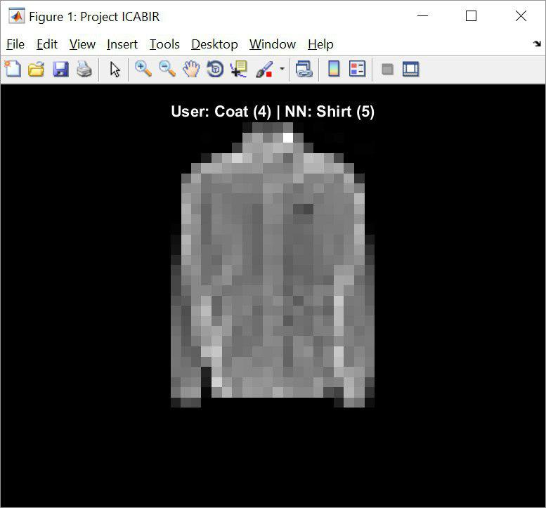

# ICABIR

ICABIR - Identification of Clothes and Accessories Based on Image Recognition

## 📥 Installation instructions

1. Install the [**_ICABIR.m_**](ICABIR.m)
2. Install the [**Fashion-MNIST**](https://github.com/zalandoresearch/fashion-mnist) dataset zipped .jpeg images from [**Dropbox**](https://www.dropbox.com/s/3sddmn90pf50zi6/Datasets.zip?dl=0)
3. Unzip the dataset

## 🛠 Configuration instructions

In [**_ICABIR.m_**](ICABIR.m) file one should modify the lines to set the full path to the unzipped datasets:

```matlab
%% Getting the data
% Full path of train images data set folder (subject to change)
trainImgFolder = fullfile();

% Full path of test images data set folder (subject to change)
testImgFolder = fullfile();
```

Reference on how to use "fullfile()": [**MathWorks fullfile() documentation**](https://se.mathworks.com/help/matlab/ref/fullfile.html)

### Remarks

1. **trainImgFolder** variable should point to ".../Datasets/Train"
2. **testImgFolder** variable should point to ".../Datasets/Test"
3. **Datasets** folder is optional

## ⚙️ Operating instructions

### Algorithm

1. User calls the **ICABIR(x)** function, while passing a singular integer value **x**, between 0 and 9 inclusively, which represents the object, NN should classify

Index | Object
----- | ------
0 | T-shirt/top
1 | Trouser
2 | Pullover
3 | Dress
4 | Coat
5 | Sandal
6 | Shirt
7 | Sneaker
8 | Bag
9 | Ankle boot

2. Importing layers of a convolutional neural network from **digitsDAGnet.h5** modelfile. Layer structure is shown on the following picture



3.	Creating an **ImageDatastore** object, which automatically labels the images based on names of the folders, they are in. An image datastore allows to store large image data, including data that does not fit in memory, and efficiently read batches of images during training of a convolutional neural network

4.	Choosing a random image of a label x in the folder, denoted by testImgFolder, which NN has not “seen” before

5.	Initializing the NN training options as:
    - **sgdm** – [**Stochastic Gradient Descent with Momentum algorithm**](https://en.wikipedia.org/wiki/Stochastic_gradient_descent)
    - **MaxEpochs** – maximum amount of elapsing epochs, while network will be training itself; limited in order to prevent overfitting
    - **InitialLearnRate** – initial learning rate of the NN
6.	Training the NN with the train data set, and saving its data to the NN object
7.	Classifying the random image of the user-entered label, and saving result into **classificationResult** variable
8.	Preparing the output figure data
9.	Showing the output figure

If NN has properly classified the image, output figure title labels should be the same | If NN has not properly classified the image, output figure title labels should be different
-------------------------------------------------------------------------------------- | -------------------------------------------------------------------------------------------
 | 

## 🗃 File manifest

- _img_ ( **_3_** )
	- correct_classification_result_ex.jpg
	- wrong_classification_result_ex.jpg
	- layer_structure.png
- ICABIR.m
- README.md
- LICENCE

### Total: **_6_** files

## ⚖️ Copyright and licensing information

This project is licensed under the [**MIT Licence**](https://en.wikipedia.org/wiki/MIT_License). 
See the [**_LICENSE_**](LICENSE) file for details

## ⚠️ Known bugs, problems and troubleshooting

### "_The program does not run, because some functions do not exist_"

#### Problem:
	
There is no [**Deep Learning Toolbox**](https://se.mathworks.com/products/deep-learning.html) installed on one's machine

#### Solution:

Install [**Deep Learning Toolbox**](https://se.mathworks.com/products/deep-learning.html)

### "_The program can not find the proper path to the data sets_"

#### Problem:
	
The following lines were not changed upon configuration

```matlab
%% Getting the data
% Full path of train images data set folder (subject to change)
trainImgFolder = fullfile();

% Full path of test images data set folder (subject to change)
testImgFolder = fullfile();
```

#### Solution:

Follow [**Configuration instructions**](https://github.com/roman-bezusiak/ICABIR#configuration-instructions)

## 👏 Credits and acknowledgments

### Authors:
- **Roman Bezusiak** - _Initial work_ - [github.com](https://github.com/roman-bezusiak)

### Used resources:
- **[Wikimedia Foundation Inc.](https://wikimediafoundation.org/wiki/Home), Wikipedia** - _Encyclopedia materials_ - [wikipedia.org](https://www.wikipedia.org/)
- **[Mathworks Inc.](https://se.mathworks.com/), Mathworks** - _MATLAB Documentation_ - [mathworks.com](https://se.mathworks.com/help/)
- **Fashion-MNIST** - _Fashion-MNIST dataset_ - [github.com](https://github.com/zalandoresearch/fashion-mnist)

### Used code:
- **Deep Learning Toolbox** - _Base of the project_ - [mathworks.com](https://se.mathworks.com/products/deep-learning.html)
- **Importing TensorFlow-Keras models** - _Self-explanatory_ -[mathworks.com](https://se.mathworks.com/matlabcentral/fileexchange/64649-deep-learning-toolbox-importer-for-tensorflow-keras-models)
- **mnist-csv-png** - _Fashion-MNIST dataset convertion script_ - [github.com](https://github.com/pjreddie/mnist-csv-png)
